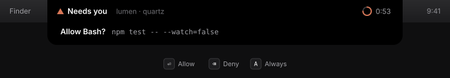
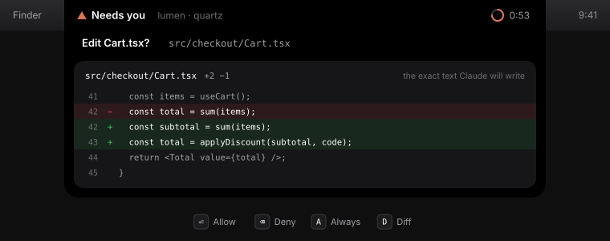
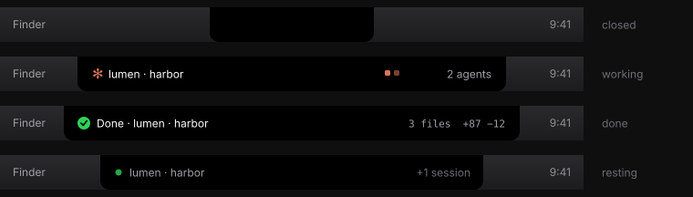
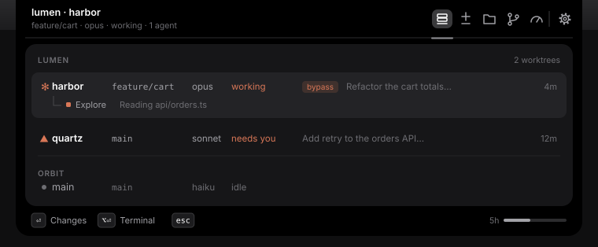
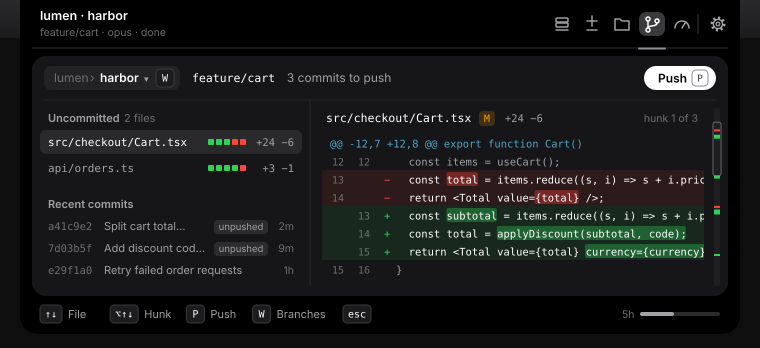
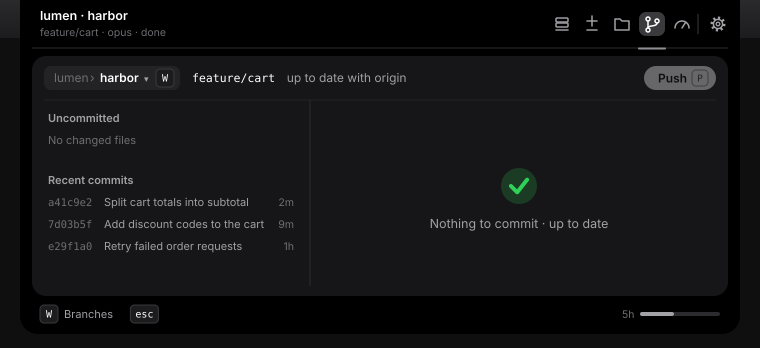

# notchcode

The MacBook notch as a companion for Claude Code. See what every session is doing from any app, and allow or deny a permission request with one key without leaving your work.

<p align="center"></p>

## What it does

### Doorbell

When Claude asks to run a command, edit a file, or commit, the notch grows to two rows, names the request, and waits. `⏎` allows, `⌫` denies, `A` allows always. For a code change, `D` opens the real diff inside the card, built from the exact text Claude wants to write, so you approve what you have read and not a pair of counts.

<p align="center"></p>

Answer in the terminal instead and the card folds away. Answer nowhere and the terminal prompt takes over after a minute. notchcode never denies anything on your behalf.

### Traffic light

From any app or space you can see whether Claude is working, blocked on you, or done, across every session on the machine.

<p align="center"></p>

Closed, the notch looks exactly like the hardware. Nothing is drawn over the camera; every state is a left wing, the camera gap, and a right wing, with the card below.

### Companion

Press the notch at any time and a card opens with five tools. `1`–`5` or `⇥` moves between them, `esc` closes.

<p align="center"></p>

| Tool | Shows |
|---|---|
| Sessions | every live session by repository, one row per worktree: branch, model, permission mode (`bypass` in clay, `plan` in blue; nothing for default), state, current prompt, a lane per subagent. `⏎` opens its Changes. |
| Changes | the session as a timeline, newest first: each turn that changed files with its files as chips (a subagent's carry its colour square), runs of quiet turns folded into one row, the live turn breathing at the top. `⏎` on a chip opens its diff beside the timeline; `/` shows only the turns with edits. |
| Files | the repository tree, changed files badged, and a preview with changed lines tinted; `⌘B` folds the tree away, and Markdown renders with a Preview · Code switch. |
| Git | the focused session's worktree, or any local branch of a repository a session runs in (`W` opens the picker: each branch with where it lives, "worktree harbor", "main checkout" or "not checked out"). A checklist of the uncommitted files on the left with the commit's summary field docked under it, the selected file's diff on the right with line numbers, changed words lit and a minimap. A branch checked out nowhere shows its changes against main, read-only. Commit the files you check, pull, push, fetch, or undo the last unpushed commit. |
| Usage | 5-hour, weekly and per-model (Fable) limits with reset times, context with what the last call cached, this session's cost, time and lines from Claude Code, today's tokens, where the week went, and what's using your limits. |

### Git without leaving the notch

The Git tool shows what is uncommitted in the worktree you are looking at, and the diff of each file. Tick the files you want, press `C` and the summary field docked under the list slides up into a full commit form, and `⏎` commits them. Add co-authors with the "@ Co-author" pill: it suggests the people your recent commits credited and writes GitHub's Co-authored-by trailers. One pill on `P` publishes, pulls, pushes or fetches, and after a commit the field shows it with an Undo (`U`) until you push. Claude's own commits still go through the commit request, as before.

<p align="center"></p>

With nothing to commit, the two panes stay and the right one says so.

<p align="center"></p>

### Teleport

Every session knows which terminal started it. One key lands you in that window; with several worktrees of one repository open at once, this is the reason to keep the app.

## Install

### Requirements

- A MacBook with a notch (2021 or later) running macOS 14 or newer. On a display without a notch the app draws nothing yet.
- Claude Code.
- For now, Xcode and [XcodeGen](https://github.com/yonaskolb/XcodeGen), because there is no download yet. Accept the Xcode licence once with `sudo xcodebuild -license accept`, and install XcodeGen with `brew install xcodegen`.

### Today: build it once

From a clone of this repository:

```sh
scripts/dev.sh            # generate the project, build, launch
scripts/dev.sh --demo     # the same, walking every state with sample data
```

The first command builds the app and opens it over the notch. The second does the same and plays every state with sample data, so you can see it before connecting anything.

After this one build the app stays on your Mac, in `build/DerivedData/Build/Products/Debug/notchcode.app` inside the clone. You do not run the script again unless you want a newer version. The app does not start at login yet; after a restart, open it again:

```sh
open build/DerivedData/Build/Products/Debug/notchcode.app
```

### Connect Claude Code

Open the card (click the notch, or press `⌥ space`), press the gear, then press Connect.

Connect adds notchcode's hooks to `~/.claude/settings.json` beside your own, and never changes your other hooks. It chains the status line, so the one you already use keeps running and notchcode gets your usage limits. It backs the file up first, and Disconnect puts everything back.

Sessions already running keep their old hooks until you restart them.

### Coming

Not available yet:

- A notarised download and a Homebrew cask.
- Open at login, and a first-run Welcome card in the notch.
- The Claude Code plugin on a marketplace.

## Keys

While the card is open the notch takes the keyboard; the moment it closes, focus goes back to your terminal.

| Key | Does |
|---|---|
| `⌥ space` | open or close the card from anywhere |
| `⏎` | allow, or the primary action |
| `⌫` | deny |
| `A` | allow always |
| `D` | show the diff behind a request |
| `1` – `5` | Sessions, Changes, Files, Git, Usage |

<details>
<summary>Every key</summary>

| Key | Does |
|---|---|
| `⌥ space` | open or close the card from anywhere |
| `⏎` | the primary action: allow, commit, open the selected session or file; in Changes, a chip's diff (again: the terminal) or a quiet group's turns |
| `⌫` | deny, or skip a commit |
| `A` | allow always |
| `E` | edit a proposed commit: Claude asks you for a new message |
| `D` | show the diff behind a permission or commit request |
| `1` – `5` | pick a tool: Sessions, Changes, Files, Git, Usage |
| `⇥` `⇧⇥` | next and previous tool |
| `↑` `↓` `←` `→` | move in a list or the file tree (in Git, `↑` `↓` select a file and show its diff) |
| `y` | copy `path:line` of the first changed line (in Changes, of the chip under the cursor) |
| `/` | filter the Files tree, or the Git branch picker past eight branches; in Changes, only the turns with edits |
| `⌘B` | hide or show the Files tree, or the Git file list (one switch for both); in Changes, the timeline beside an open diff |
| `P` | switch a Markdown file between Preview and Code (Files); the sync pill: publish, pull or push after a `⏎` confirm, or fetch at once (Git) |
| `C` | open the commit form: `⏎` or `⌘⏎` commits the checked files, `esc` backs out (Git) |
| `space` | put the selected file in or out of the commit (Git) |
| `U` | undo the newest unpushed commit; its changes and message come back (Git) |
| `W` | the Git branch picker: every local branch of a repository (`↑` `↓`, `⏎` shows that branch, `esc` goes back) |
| `R` | in the Git branch picker, the repository dropdown (`↑` `↓`, `⏎` picks, `esc` closes); in Usage, refresh the plan limits with `claude -p /usage` |
| `⌥⏎` | jump to the session's terminal |
| `⌘,` | Settings |
| `⌘Q` | quit notchcode (while the card is open) |
| `esc` | back (in Changes: show the timeline, then close the diff), or close |

</details>

## How it works

1. **Session files.** Claude Code writes every session to `~/.claude/projects/<folder>/<session>.jsonl`, and notchcode polls that folder every two seconds. That alone gives sessions, prompts, files, diffs, subagents, tokens, and cost, with no setup.
2. **Hooks.** One shell script, called by Claude Code's hooks, sends one JSON line over a Unix socket in `~/Library/Application Support/notchcode/`. For a permission request or a `git commit` it waits for your answer; if the app is not running it prints nothing and exits at once.
3. **Status line.** Claude Code hands its status line command the 5-hour and weekly limits. notchcode's status line script forwards them to the app, then runs whatever status line you had before.

It is the sibling of [sidecar-pane](https://github.com/evch1204/sidecar-pane), which shows the same stream in a terminal split. They share a data contract, not code.

<details>
<summary>The hooks it adds</summary>

| Claude Code event | Matcher | Blocks Claude? |
|---|---|---|
| `PermissionRequest` | all tools | until you answer, or 58 s pass |
| `PreToolUse` | `Bash`, only `git commit …` | the same |
| `PostToolUse` | `Edit`, `Write`, `MultiEdit`, `Bash` | no |
| `Notification`, `Stop`, `UserPromptSubmit` | | no |
| `SessionStart`, `SessionEnd`, `SubagentStart`, `SubagentStop` | | no |
| `statusLine` | | no; chained in front of your existing one |

</details>

### What it touches

The app never edits your project and makes no network requests of its own beyond what `git` does when you push, pull or fetch. The one command it runs is `git`, for the Git tool. Read-only commands show the worktree. The writes are: push, pull (fast-forward only), fetch, a commit of the files you checked, and a mixed reset for Undo. Each runs only when you press it, except one quiet fetch when the tool opens (at most every 5 minutes per repository). Nothing else, and never from a hook. The only file it writes outside its own folder is `~/.claude/settings.json`. It adds or removes only its own entries there, after a backup named `settings.json.notchcode-backup-<time>` (the newest five are kept), and only when you press Connect or Disconnect.

## Settings

A page inside the card, never a separate window: the gear, or `⌘,` while the card is open. It holds what shows when idle (the resting row, or a pure notch), how "needs you" looks (two rows, or wings only), whether finished turns and agents peek and for how long, whether every file edit peeks too, click or hover to open, the `⌥ space` hotkey, agents in the wings, whether keys show beside buttons in the card, an optional macOS notification for blocking requests, and Connect / Disconnect with live status. Quit lives here too, or `⌘Q` while the card is open; `esc` only closes the card.

## Uninstall

1. Press Disconnect in Settings, or run `node scripts/disconnect.mjs` from the clone. This removes only notchcode's hooks and restores your status line.
2. Quit notchcode from Settings, or `⌘Q` while the card is open.
3. Delete the app (the `build` folder in the clone, or the clone itself) and `~/Library/Application Support/notchcode`.

## Development

Useful commands:

```sh
xcodebuild -scheme notchcode build          # the check before a commit
scripts/send-test-event.sh permission       # fire a fake event at the running app
scripts/send-test-event.sh all
open build/DerivedData/Build/Products/Debug/notchcode.app --args --debug-keys open,c,2,esc   # drive the card without touching the keys: open (or open:changes), then each key 1.2 s apart (a number sleeps)
scripts/sync-plugin.sh --check              # plugin in step with hooks/
```

Rules the code follows: Swift and SwiftUI only; the app acts on your behalf only through hooks; hook scripts print nothing, have no dependencies, and exit 0 when the app is absent; every visual constant lives in `Theme.swift`; the closed state is pixel-identical to the notch.

The plugin adds the hooks without touching `settings.json` and opens the app when a session starts, but cannot carry usage limits. Load it for one session; use it or Connect, not both, or every event arrives twice. See [plugin/README.md](plugin/README.md).

```sh
claude --plugin-dir ./plugin
```

<details>
<summary>Layout and scripts</summary>

```
Sources/notchcode/
  App/                     the app entry, hotkey, keyboard routing
  Core/                    the one contract every part talks through, preferences, the diff engine
  ClaudeCode/              session files, the transcript watcher, the installer
  Transport/               the Unix socket server
  State/                   the app's live state
  UI/                      the theme (every colour, size, font, radius, spring, glyph), components, shared controls, the diff views
  Notch/                   the panel over the notch, the shape, every surface drawn in it
  Features/                one folder per tool: Sessions, Changes, Files, Git, Usage, Requests, Settings; each with its model, its AppState extension and its tab
  Demo/                    the --demo script
hooks/                     the two shell scripts Claude Code calls
scripts/                   connect, disconnect, test events, dev build, plugin sync
plugin/                    the Claude Code plugin
docs/readme/               the drawings on this page
PLAN.md                    the spec: states, events, decisions, motion table
```

Connect without the app, with Node 20. Both take `--settings <path>` and `--dry-run`, follow the same rules as Connect, and are safe to run twice:

```sh
node scripts/connect.mjs      # add the hooks and chain the status line
node scripts/disconnect.mjs   # remove only ours, restore the status line
```

</details>

## Status

Working on the owner's machine, unsigned, built from source. Next: a notarised build and a Homebrew cask, a marketplace entry for the plugin, and a floating pill for displays without a notch.
